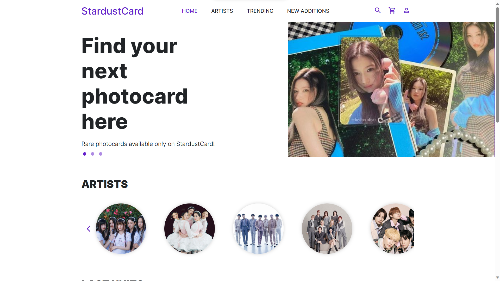

# StardustCard - Client HTML

Este repositório contém os arquivos HTML das telas do projeto destinadas à parte cliente do projeto `StardustCard`.



## Como Usar

### Git Clone

```bash
git clone https://github.com/StardustOrg/BasicHTML_Client.git
```

### Acessar o HTML

Depois de clonar o repositório, siga os passos abaixo:

1. Navegue até o diretório onde o repositório foi clonado.

2. Abra qualquer arquivo `.html` em seu navegador preferido.

## Telas Disponíveis

1. Login
2. Home
3. Artistas
4. Tela de compra
5. Carrinho de compra
